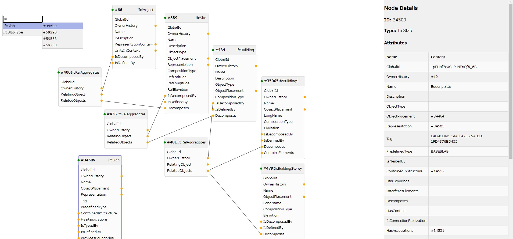

# IFC graph viewer

IFCファイルのグラフ可視化アプリ



## 動作環境

以下で確認

- Windows10
- Google Chrome: 120.0.6099.72
- node:  16.15.0
- npm:  9.7.1
- Python:  3.12.9
- IfcOpenShell: 0.8.0

## インストール

バックエンドをPythonのFlask、フロントエンドをVite+Vue+TSで構築しているので、PythonとNode.jsの両方の環境を作る必要がある。

### Python

```sh
cd python
python -m venv env
env\Scripts\activate.bat
pip install -r requirements.txt
```

### Node.js

```sh
cd nodejs
npm install
```

## 実行方法

### 方法1

Pythonでバックエンド起動する。

```sh
python server.py
```

Node.jsでフロントエンド起動する。

```sh
npm run dev
```

両方を起動した状態で「localhost:5173」にブラウザでアクセスする

### 方法2：ビルド

フロントエンドをビルドする。

```sh
npm run build
```

作成された「nodejs/dist」を「python/dist」に移動し、Pythonでバックエンド起動する。

```sh
python server.py
```

Pythonを動かした状態で「localhost:5000」にブラウザでアクセスする。

### 方法3：Releasesのexeを使う

[Releases](https://github.com/kiyuka829/ifc-graph-viewer/releases) にアップロードしている zip を解凍して、
`ifc-graph-viewer.exe` を実行する。

## exe化

[方法2：ビルド](#方法2ビルド) で実行できる状態にしてから、以下のコマンドを実行。

```sh
nuitka --standalone --follow-imports app.py --output-dir=../dist --include-data-dir=dist=dist --output-filename=ifc-graph-viewer
```

## 使い方簡易説明

- 「ファイルの選択」からIFCファイルを選択する
  - 対応しているファイル形式は `.ifc` のみ
- ノードを選択すると画面右にノードの情報が表示される
- Shift+ドラッグでノードを複数選択できる
- ノードの黄色の丸をドラッグすることで、接続先のノードを展開される
- ノードを選択した状態でDeleteキーを押すとノードが削除される
- 右クリックを押すと検索ウィンドウが表示される
  - 検索ウィンドウのIDを選択すると右クリックした場所にノードが表示される
- マウスホイールで表示の拡大縮小ができる
