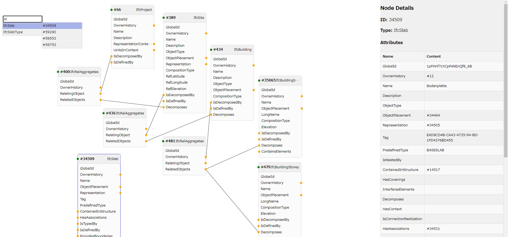

# IFC Graph Viewer

Graph visualization app for IFC files. Try the [browser version](https://kiyuka829.github.io/ifc-graph-viewer/).



## Installation

The backend uses Python FastAPI, and the frontend uses Vite + Vue + TS.

### Python

```sh
cd python
uv sync
```

### Node.js

```sh
cd nodejs
npm install
```

## How to Run

### Method 1: Run in a Development Environment

Start the backend with Python.

```sh
uv run uvicorn fastapi_server:app --reload
```

Start the frontend with Node.js.

```sh
npm run dev:python
```

With both services running, open `http://localhost:5173` in your browser.

### Method 2: Build and Run

Build the frontend.

```sh
npm run build:python
```

Move the generated `nodejs/dist` directory to `python/dist` and start the backend with Python.

```sh
uv run uvicorn fastapi_server:app --reload
```

With Python running, open `http://localhost:8000` in your browser.

### Method 3: Run Without Python

Run the application entirely in the browser without Python.

```sh
cd nodejs
npm run dev:browser
```

Open `http://localhost:5173` in your browser.

To build the application, run:

```sh
cd nodejs
npm run build:browser
npm run preview -- --mode browser
```

Open `http://localhost:4173` in your browser.

### Method 4: Use the exe from Releases

Extract the zip file uploaded to [Releases](https://github.com/kiyuka829/ifc-graph-viewer/releases) and run `ifc-graph-viewer.exe`.

## Creating exe

After completing [Method 2: Build and Run](#method-2-build-and-run), run the following command:

```sh
uv run nuitka app.py --standalone --follow-imports --windows-console-mode=disable --output-dir=../dist --include-data-dir=dist=dist --output-filename=ifc-graph-viewer
```

## Basic Usage Guide

- Drag and drop IFC files onto the screen
  - Supported file formats are `.ifc` and `.ifcx (ifcx_alpha)` only
  - `.ifcx` supports simultaneous dropping of multiple files
- Select a node to display its information on the right side of the screen
- Shift + drag to select multiple nodes
- Drag the circle on a node to expand connected nodes
- Select a node and press the Delete key to remove the node
- Open the search window from the Search button in the center of the header
  - Select an ID in the search window to display a node near the top-left area of the canvas
- Use the mouse wheel to zoom in and out of the display
- Use the zoom controls in the top-right of the header to zoom in or out, reset the view, or fit the model to the screen
