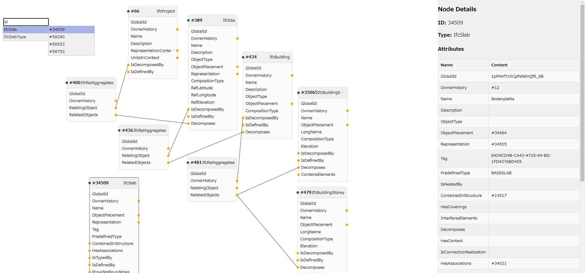

# IFC Graph Viewer

IFC ファイルのグラフ可視化アプリ



## インストール

バックエンドを Python の FastAPI、フロントエンドを Vite+Vue+TS で構築しているので、Python と Node.js の両方の環境を作る必要がある。

### Python

```sh
cd python
uv sync
```

### Node.js

```sh
cd nodejs
npm install
```

## 実行方法

### 方法 1

Python でバックエンド起動する。

```sh
uv run uvicorn fastapi_server:app --reload
```

Node.js でフロントエンド起動する。

```sh
npm run dev
```

両方を起動した状態で「localhost:5173」にブラウザでアクセスする

### 方法 2：ビルド

フロントエンドをビルドする。

```sh
npm run build
```

作成された「nodejs/dist」を「python/dist」に移動し、Python でバックエンド起動する。

```sh
uv run uvicorn fastapi_server:app --reload
```

Python を動かした状態で「localhost:8000」にブラウザでアクセスする。

### 方法 3：Releases の exe を使う

[Releases](https://github.com/kiyuka829/ifc-graph-viewer/releases) にアップロードしている zip を解凍して、
`ifc-graph-viewer.exe` を実行する。

## exe 化

[方法 2：ビルド](#方法-2ビルド) で実行できる状態にしてから、以下のコマンドを実行。

```sh
uv run nuitka --standalone --follow-imports app.py --output-dir=../dist --include-data-dir=dist=dist --output-filename=ifc-graph-viewer
```

## 使い方簡易説明

- IFC ファイルを画面にドラッグ&ドロップする
  - 対応しているファイル形式は `.ifc`, `.ifcx (ifcx_alpha)` のみ
  - `.ifcx` は複数ファイルの同時ドロップ対応
- ノードを選択すると画面右にノードの情報が表示される
- Shift+ドラッグでノードを複数選択できる
- ノードの丸をドラッグすることで、接続先のノードを展開される
- ノードを選択した状態で Delete キーを押すとノードが削除される
- ヘッダー中央の Search ボタンから検索ウィンドウを開ける
  - 検索結果の ID を選択すると、キャンバス左上付近にノードが表示される
- マウスホイールで表示の拡大縮小ができる
- ヘッダー右上のズーム操作で拡大・縮小・リセット・全体表示（Fit）ができる
